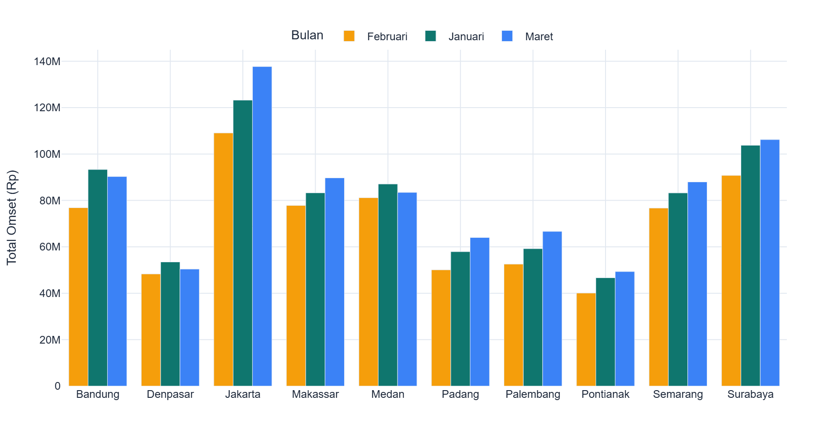
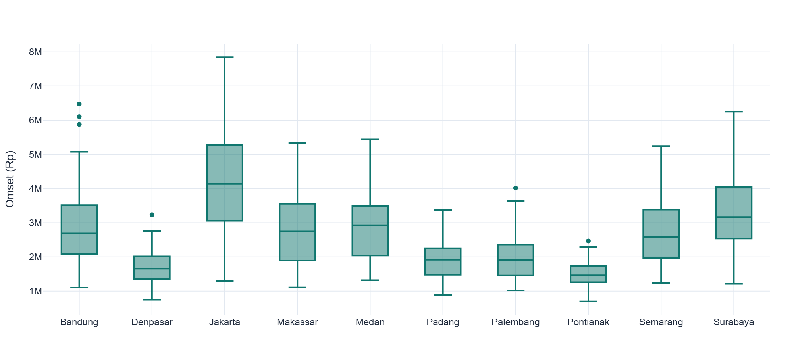
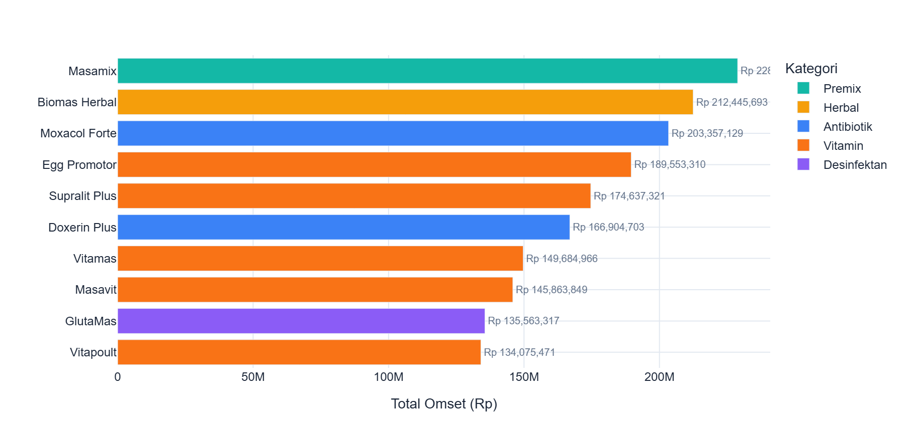
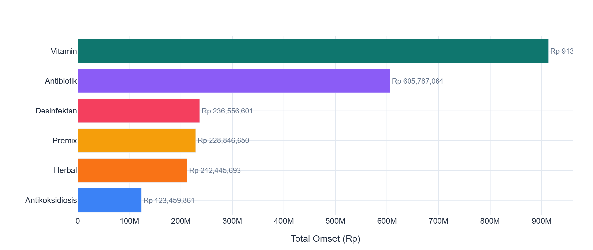
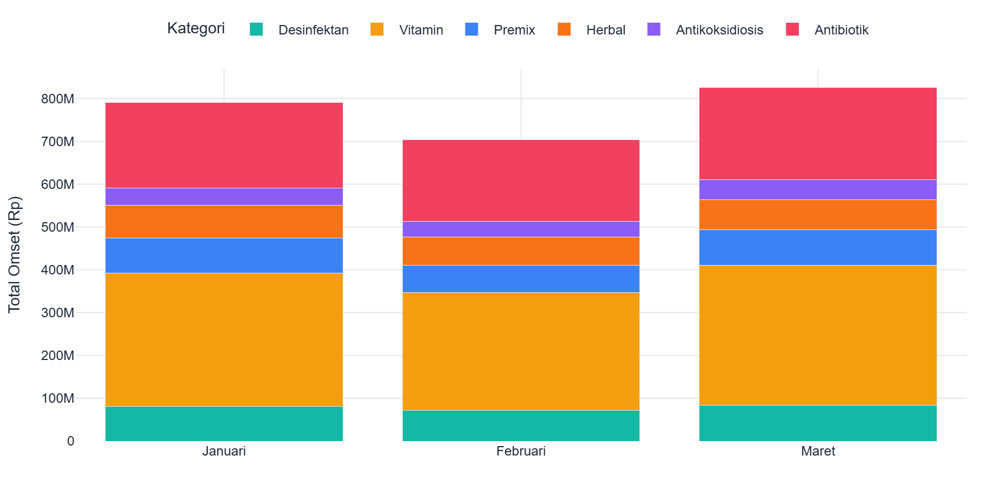
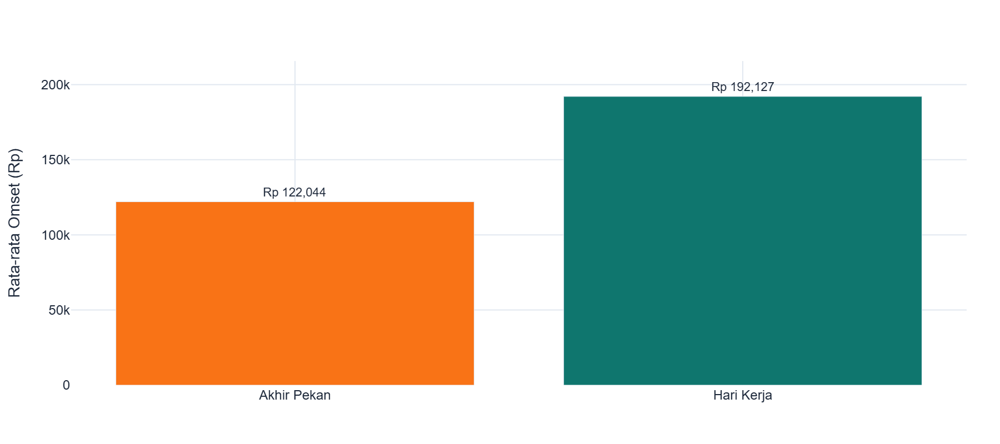
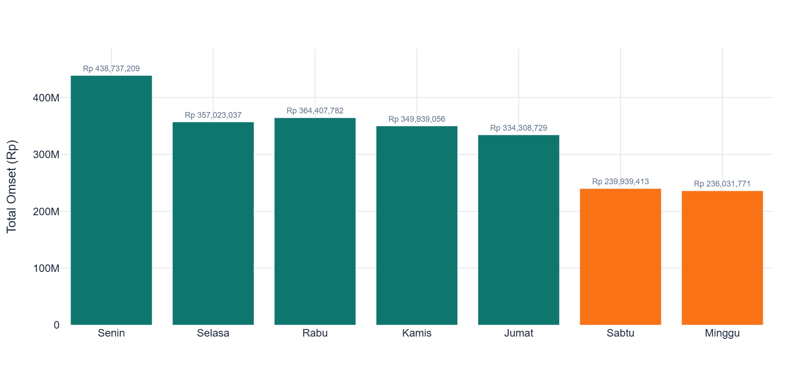
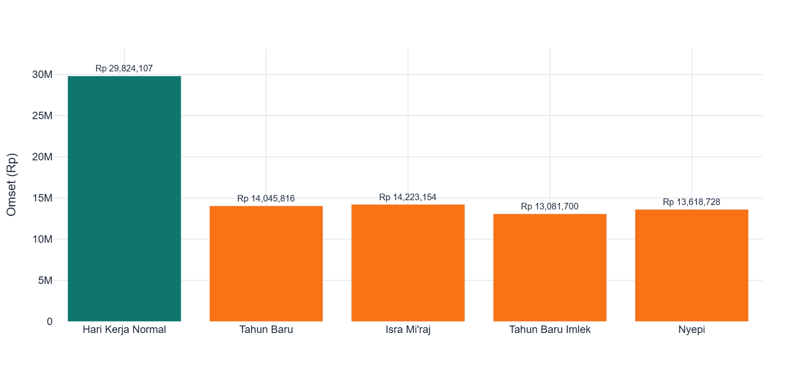
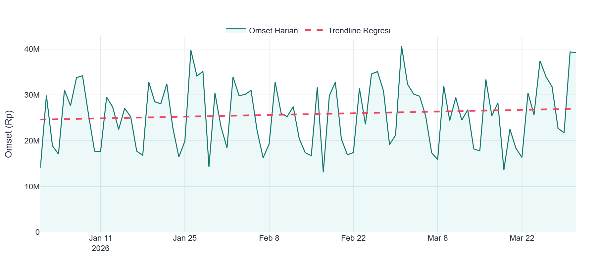
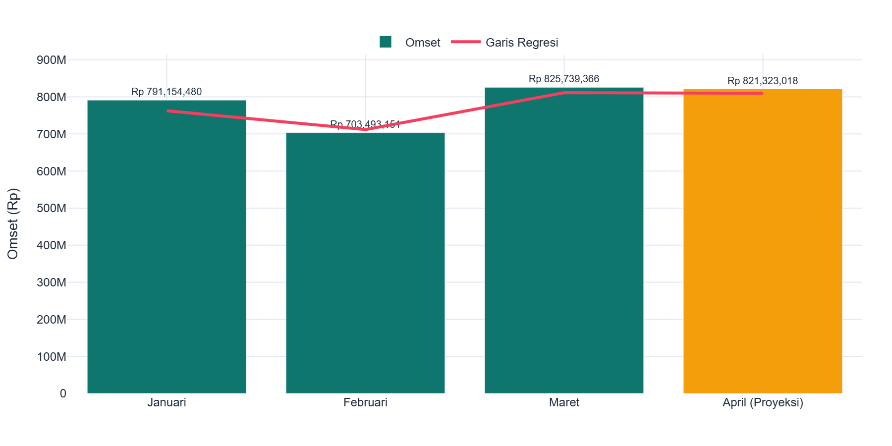

# LAPORAN ANALISIS PENJUALAN
## PT Mensana Aneka Satwa
### Periode: Januari - Maret 2026 (Q1)

---

**Disusun oleh:** Guntur Adi Wardana

**Tanggal:** 8 Juli 2026

---

## 1. RINGKASAN EKSEKUTIF

PT Mensana Aneka Satwa mencatat total omset **Rp 2.320.386.997** dari 10 cabang distributor di seluruh Indonesia selama Q1 2026. Dari jumlah tersebut, 15 produk unggulan terjual sebanyak 20.892 unit selama 90 hari aktif penjualan.

| Metrik Utama | Nilai |
|--------------|-------|
| Total Omset | Rp 2.320.386.997 |
| Total Kuantiti | 20.892 unit |
| Rata-rata Omset/Hari | Rp 25.782.078 |
| Cabang Tertinggi | Jakarta (Rp 369,98 juta) |
| Produk Terlaris | Masamix (Rp 228,85 juta) |
| Kategori Terlaris | Vitamin (39,4% dari total) |

**Temuan Utama:**
- Pola bulanan fluktuatif: Februari turun 11,1%, Maret recovery +17,4%
- Disparitas cabang signifikan: Jakarta 2,72x lebih besar dari Pontianak
- Weekend dan hari libur menyebabkan penurunan omset drastis
- Harga jual sangat konsisten dengan standar perusahaan (deviasi <0,1%)

---

## 2. DATA & METODOLOGI

### Sumber Data

Data penjualan dihasilkan dari simulasi 10 cabang distributor PT Mensana Aneka Satwa selama 3 bulan (Januari - Maret 2026). Data di-generate menggunakan script Python (`generate_daily_data.py`) dengan parameter realistis berdasarkan karakteristik bisnis distribusi obat/vitamin ternak di Indonesia.

### Cara Pengambilan Data

Data tidak diambil dari sistem operasional perusahaan, melainkan **dihasilkan secara simulasi** dengan pendekatan berikut:

**1. Konfigurasi Dasar**
- 10 cabang distributor di kota-kota besar Indonesia
- 15 produk standar perusahaan (6 Vitamin, 4 Antibiotik, 1 Premix, 1 Herbal, 1 Antikoksidiosis, 2 Desinfektan)
- Periode: 90 hari (1 Januari - 31 Maret 2026)
- Seed random `np.random.seed(42)` untuk reproducibility

**2. Harga Jual**

Harga satuan di-generate dengan variasi ±10% dari harga standar perusahaan, mencerminkan fleksibilitas pricing di lapangan.

**3. Mapping Produk Tiap Cabang**

Setiap cabang memiliki kode dan nama produk yang berbeda untuk produk yang sama (mencerminkan kondisi real). Mapping table dibuat untuk menghubungkan kode lokal ke kode standar.

### Tantangan Utama
> Setiap cabang menggunakan **kode dan nama produk yang berbeda-beda** untuk produk yang sama.

Contoh produk "Supralit" di tiga cabang:

| Cabang | Kode Lokal | Nama Lokal |
|--------|-----------|------------|
| Medan | MED-V-001 | Supralit Anti Stress |
| Jakarta | JKT-VA-001 | Supralit Powder |
| Bandung | BDG/01/V | Anti-Stress Powder |
---

## 3. PERFORMA BULANAN

Omset Q1 2026 menunjukkan pola fluktuatif dengan recovery kuat di Maret.

| Bulan | Total Omset | Hari | Rata-rata/Hari | Pertumbuhan |
|-------|------------|------|-----------------|-------------|
| Januari | Rp 791.154.480 | 31 | Rp 25.521.112 | - |
| Februari | Rp 703.493.151 | 28 | Rp 25.124.755 | -11,1% |
| Maret | Rp 825.739.366 | 31 | Rp 26.636.754 | +17,4% |

Februari mengalami penurunan karena hari lebih sedikit (28 vs 31) dan adanya hari libur Imlek. Maret menunjukkan recovery kuat, menjadikan bulan dengan omset tertinggi di Q1.

{ width=100% }

Pola serupa terjadi di hampir semua cabang: turun di Februari, naik di Maret. Jakarta konsisten sebagai kontributor terbesar.

---

## 4. PERFORMA CABANG

Jakarta dan Surabaya menyumbang **28,9% total omset** dari hanya 2 dari 10 cabang. Sementara 4 cabang terbawah (Palembang, Padang, Denpasar, Pontianak) menyumbang 27,5%.

### Ranking Cabang

| Rank | Cabang | Total Omset | % Total | Status |
|------|--------|------------|---------|--------|
| 1 | Jakarta | Rp 369.977.238 | 15,9% | Top Performer |
| 2 | Surabaya | Rp 300.746.237 | 13,0% | Top Performer |
| 3 | Bandung | Rp 260.462.839 | 11,2% | Good |
| 4 | Medan | Rp 251.699.464 | 10,8% | Good |
| 5 | Makassar | Rp 250.787.565 | 10,8% | Good |
| 6 | Semarang | Rp 247.926.039 | 10,7% | Good |
| 7 | Palembang | Rp 178.443.705 | 7,7% | Perlu Peningkatan |
| 8 | Padang | Rp 172.000.578 | 7,4% | Perlu Peningkatan |
| 9 | Denpasar | Rp 152.216.908 | 6,6% | Perlu Peningkatan |
| 10 | Pontianak | Rp 136.126.424 | 5,9% | Perlu Peningkatan |

\newpage

### Distribusi Omset Harian per Cabang

Box plot berikut menunjukkan variasi omset harian tiap cabang. Cabang dengan median lebih tinggi dan variasi lebih kecil menunjukkan performa yang lebih stabil.

{ width=100% }

---

## 5. ANALISIS PRODUK

### Top 10 Produk Terlaris

Top 5 produk menyumbang **43,5% total omset**. Masamix (Premix) menjadi produk terlaris meski hanya 1 produk di kategorinya, didukung harga satuan tertinggi (Rp 167.000).

{ width=100% }

### Distribusi per Kategori

Vitamin mendominasi dengan 39,4% dari 6 produk, diikuti Antibiotik 26,1%. Premix meski hanya 1 produk menyumbang 9,9% karena harga satuan tinggi.

| Kategori | Total Omset | % Total | Jumlah Produk |
|----------|------------|---------|---------------|
| Vitamin | Rp 913.291.128 | 39,4% | 6 |
| Antibiotik | Rp 605.787.064 | 26,1% | 4 |
| Desinfektan | Rp 236.556.601 | 10,2% | 2 |
| Premix | Rp 228.846.650 | 9,9% | 1 |
| Herbal | Rp 212.445.693 | 9,2% | 1 |
| Antikoksidiosis | Rp 123.459.861 | 5,3% | 1 |

{ width=90% }

Pola kategori per bulan relatif stabil, menunjukkan permintaan konsisten dari bulan ke bulan.

{ width=100% }

---

## 6. POLA PENJUALAN HARIAN

### Hari Kerja vs Akhir Pekan

Penjualan pada hari kerja (Sen-Jumat) **48% lebih tinggi** dari akhir pekan. Senin memiliki omset tertinggi karena efek restocking awal pekan, sementara Jumat sedikit lebih rendah karena pelanggan menunda pembelian menjelang weekend.

| Tipe Hari | Rata-rata Omset/Hari | Selisih |
|-----------|----------------------|---------|
| Hari Kerja (Sen-Jum) | Rp 28.500.000 | baseline |
| Akhir Pekan (Sab-Ming) | Rp 14.700.000 | -48,4% |

{ width=80% }

### Pola Harian

| Hari | Index (Senin=100) | Keterangan |
|------|-------------------|------------|
| Senin | 100 | Tertinggi - restocking awal pekan |
| Selasa - Kamis | 96-98 | Stabil |
| Jumat | 88 | Pre-weekend dip |
| Sabtu | 57 | Turun drastis |
| Minggu | 40 | Terendah |

{ width=100% }

### Dampak Hari Libur Nasional

Hari libur nasional menyebabkan penurunan omset **45-49%** dari rata-rata hari kerja normal. Efek recovery terjadi 1-2 hari setelah libur, menunjukkan adanya pembelian tertunda.

| Hari Libur | Omset | Penurunan |
|-----------|-------|-----------|
| Tahun Baru (1 Jan) | Rp 14.045.816 | -45,5% |
| Isra Mi'raj (29 Jan) | Rp 14.223.154 | -44,9% |
| Tahun Baru Imlek (17 Feb) | Rp 13.081.700 | -49,3% |
| Nyepi (19 Mar) | Rp 13.618.728 | -47,2% |

{ width=100% }

---

## 7. TREN & PROYEKSI

### Tren Omset Harian

Garis tren menunjukkan pola harian yang bervariasi dengan penyusutan signifikan saat hari libur, namun tren keseluruhan cenderung stabil.

{ width=100% }

### Proyeksi April 2026

Berdasarkan regresi linear dari data Q1, proyeksi omset April 2026 adalah **Rp 821.323.018** dengan tren sedikit naik (+Rp 26.589/hari). Angka ini hampir sama dengan Maret, menunjukkan stabilisasi di level tinggi.

| Bulan | Total Omset | Keterangan |
|-------|------------|------------|
| Januari 2026 | Rp 791.154.480 | Aktual |
| Februari 2026 | Rp 703.493.151 | Aktual |
| Maret 2026 | Rp 825.739.366 | Aktual |
| **April 2026** | **Rp 821.323.018** | **Proyeksi** |

{ width=100% }

---

## 8. KESIMPULAN & REKOMENDASI

### Kesimpulan

1. Total omset Q1 2026: **Rp 2,32 miliar** - performa solid untuk 10 cabang
2. Jakarta dan Surabaya menyumbang **28,9% total omset** dari 2 cabang
3. **Vitamin mendominasi** (39,4%), diikuti Antibiotik (26,1%)
4. Weekend turun **~48%** dari hari kerja, hari libur turun **45-49%**
5. Harga jual konsisten (deviasi <0,1% dari standar)

### Rekomendasi

| No | Rekomendasi | Prioritas | Estimasi Dampak |
|----|------------|-----------|-----------------|
| 1 | **Optimasi 4 cabang bawah** - Fokus peningkatan penjualan di Pontianak, Denpasar, Padang, dan Palembang melalui strategi promosi dan peningkatan frekuensi kunjungan sales | Tinggi | Peningkatan omset cabang secara signifikan |
| 2 | **Pre-stocking sebelum hari libur nasional** - Siapkan stok 2-3 hari sebelum hari libur agar pelanggan tetap bisa membeli meski sebagian cabang tutup | Tinggi | Mengurangi kehilangan penjualan saat libur |
| 3 | **Promosi weekend** - Buat program khusus atau insentif penjualan untuk hari Sabtu dan Minggu | Sedang | Meningkatkan omset akhir pekan yang saat ini sangat rendah |
| 4 | **Diversifikasi mix produk** - Sesuaikan proporsi produk di tiap cabang berdasarkan karakteristik dan permintaan pasar lokal | Sedang | Omset lebih merata dan sesuai kebutuhan pasar |
| 5 | **Review pricing** - Evaluasi harga jual untuk produk dengan margin tinggi guna memaksimalkan profitabilitas | Rendah | Peningkatan margin keuntungan |

---

## LAMPIRAN

### A. Daftar 10 Cabang

| ID | Nama Cabang | Provinsi |
|----|------------|----------|
| CAB-01 | Medan | Sumatera Utara |
| CAB-02 | Padang | Sumatera Barat |
| CAB-03 | Palembang | Sumatera Selatan |
| CAB-04 | Jakarta | DKI Jakarta |
| CAB-05 | Bandung | Jawa Barat |
| CAB-06 | Semarang | Jawa Tengah |
| CAB-07 | Surabaya | Jawa Timur |
| CAB-08 | Denpasar | Bali |
| CAB-09 | Makassar | Sulawesi Selatan |
| CAB-10 | Pontianak | Kalimantan Barat |

### B. Mapping 15 Produk

| Kode | Nama Standar | Kategori | Harga |
|------|-------------|----------|-------|
| MSV-001 | Supralit | Vitamin | Rp 85.000 |
| MSV-002 | Supralit Plus | Vitamin | Rp 125.000 |
| MSV-003 | Vitapoult | Vitamin | Rp 95.000 |
| MSV-004 | Vitamas | Vitamin | Rp 110.000 |
| MSV-005 | Egg Promotor | Vitamin | Rp 135.000 |
| MSV-006 | Masavit | Vitamin | Rp 105.000 |
| MSA-001 | Colimas | Antibiotik | Rp 78.000 |
| MSA-002 | Doxerin Plus | Antibiotik | Rp 119.000 |
| MSA-003 | Enromas | Antibiotik | Rp 92.000 |
| MSA-004 | Moxacol Forte | Antibiotik | Rp 145.000 |
| MSP-001 | Masamix | Premix | Rp 167.000 |
| MSP-002 | Biomas Herbal | Herbal | Rp 155.000 |
| MSX-001 | Coxy-Mas | Antikoksidiosis | Rp 88.000 |
| MSX-002 | GlutaMas | Desinfektan | Rp 97.000 |
| MSX-003 | Septocid | Desinfektan | Rp 72.000 |

---
